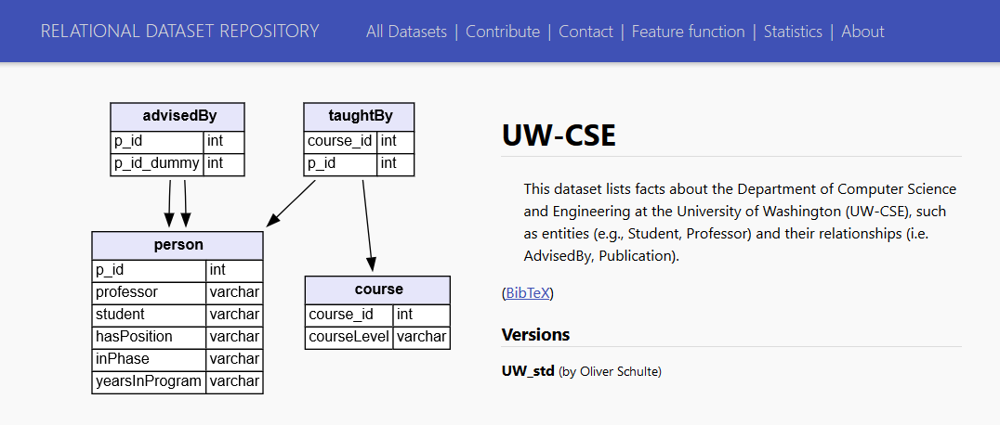
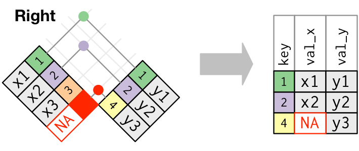
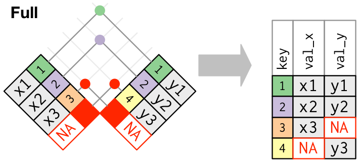
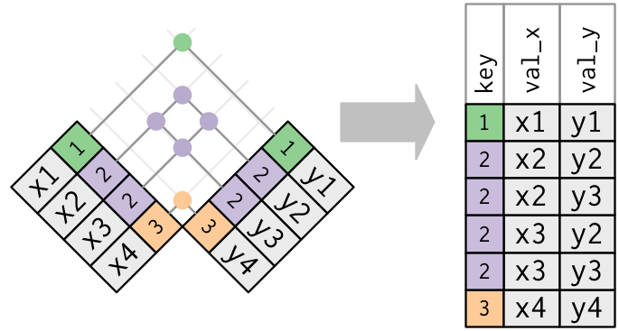

```{r setup, include=FALSE, message=FALSE}
# options(htmltools.dir.version = FALSE)
library(tidyverse)
# devtools::install_github('yihui/xaringan')
# full_join, inner_join, left_join, right_join, semi_join, anti_join
```

## Dados em múltiplas tabelas

* É comum que dados estejam guardados em múltiplas tabelas. Esse modelo de banco de dados é conhecido como *Modelo Relacional* (https://en.wikipedia.org/wiki/Relational_model), em que os dados são acessados através de um *nome de tabela*, uma *chave* (*key*) e uma *coluna* (*features*).

* Se espera que, em no mínimo uma tabela, a chave identifique unicamente cada observação.

* O material da aula é baseado no capítulo 13 do livro *R for Data Science* (Wickham & Grolemund, 2017). Leiam o capítulo para verem exemplos adicionais: http://r4ds.had.co.nz/relational-data.html

---
class: center, middle

## Exemplo


Exemplo de base relacional:

Figura de https://en.wikipedia.org/wiki/Relational_model


---

## Consultas

* Cada tabela, separadamente, funciona como os bancos de dados com que trabalhamos até agora.

* Uma coluna em comum entre as tabelas será usada como chave, ligando a informação de cada linha. Porém, não há garantias que o valor seja único, nem sempre qual coluna servirá de chave é óbvio. 

* Uma *consulta* (ou *query*) é um pedido do usuário ao *relational database management system* (RDBMS) que une informações de um grupo de indivíduos (baseados na chave) ao longo de várias tabelas.

* Nós vamos, primeiramente, examinar a operação *join*, do pacote `dplyr`, para realizar consultas em pares de tabelas.

---

## Exemplo



Professores e alunos da University of Washington, ciência da computação. 

Dados: https://relational.fit.cvut.cz/dataset/UW-CSE

Explicação: http://aiweb.cs.washington.edu/ai/mln/database.html

---

## Recuperando dados do MySQL server

Código apenas para a reprodução do exemplo. SQL será abordado só em aulas futuras.

<!-- # https://relational.fit.cvut.cz/dataset/UW-CSE 
# https://www.r-bloggers.com/accessing-mysql-through-r/ --> 

```{r eval=FALSE}
library(RMySQL)
mydb <- dbConnect(MySQL(), user='guest', password='relational', 
                 dbname='UW_std', port = 3306, 
                 host='relational.fit.cvut.cz')
rs <- dbSendQuery(mydb, "SELECT * FROM advisedBy")
advisedBy <- fetch(rs, n=-1)
rs <- dbSendQuery(mydb, "SELECT * FROM course")
course <- fetch(rs, n=-1)
rs <- dbSendQuery(mydb, "SELECT * FROM person")
person <- fetch(rs, n=-1)
rs <- dbSendQuery(mydb, "SELECT * FROM taughtBy")
taughtBy <- fetch(rs, n=-1)
dbDisconnect(mydb)
write.csv(advisedBy, "a03-advisedBy.csv", row.names = FALSE)
write.csv(course, "a03-course.csv", row.names = FALSE)
write.csv(person, "a03-person.csv", row.names = FALSE)
write.csv(taughtBy, "a03-taughtBy.csv", row.names = FALSE)
```


```{r echo=FALSE}
advisedBy <- read.csv("aula03/a04-advisedBy.csv", row.names = NULL)
course <- read.csv("aula03/a04-course.csv", row.names = NULL)
person <- read.csv("aula03/a04-person.csv", row.names = NULL)
taughtBy <- read.csv("aula03/a04-taughtBy.csv", row.names = NULL)
```

---

## advisedBy

```{r}
advisedBy %>% as_tibble
```

`p_id` orienta `p_id_dummy`.

---

## course

```{r}
course %>% as_tibble
```

`level_100` (introdução), `level_300` (graduação, segundo ano), `level_400` (graduação, avançado) e `level_500` (pós-graduação).

---

## taughtBy

```{r}
taughtBy %>% as_tibble
```

Qual curso em `course_id` e `p_id` de quem ensinou.

---

## person

```{r}
person %>% as_tibble
```

---

## Tabelas não são 1-1

```{r}
# Same course, different faculty
taughtBy %>% filter(course_id == 11)
# Same faculty, different course
taughtBy %>% filter(p_id == 40)
```

- `p_id` identifica indivíduos unicamente em `person`;
- `course_id` identifica cursos unicamente em `courses`.

---

## Objetivo da aula de hoje

* Como relacionar informação de diferentes tabelas?

* Por exemplo, é mais comum que professores adjuntos ensinem classes de pós-graduação?

* Nós sabemos trabalhar com tabelas isoladas. Para duas ou mais tabelas, consideraremos funções do tipo **JOIN**.

* Primeiramente, consideraremos os chamados **mutating joins**, que combinam variáveis de diferentes tabelas. 

---

## Tipos de JOIN: setup

Usando os diagramas de Wickham and Grolemund (2017), considere dados de duas tabelas:


A coluna colorida é a chave, `x` e `y` são colunas, tomando valores `x1`, `x2`, etc.

---

## Tipos de JOIN: setup 2

```{r}
(x <- data.frame(key = c(1,2,3), val_x = c("x1","x2","x3")))
(y <- data.frame(key = c(1,2,4), val_y = c("y1","y2","y4")))
```

---

## INNER JOIN: inner_join


---

## INNER JOIN: inner_join

```{r}
x %>% inner_join(y, by = "key")
```

---

## OUTER JOIN: left_join


---

## OUTER JOIN: left_join

```{r}
x %>% left_join(y, by = "key")
```

---

## OUTER JOIN: right_join



---

## OUTER JOIN: right_join

```{r}
x %>% right_join(y, by = "key")
```

---

## OUTER JOIN: full_join



---

## OUTER JOIN: full_join

```{r}
x %>% full_join(y, by = "key")
```

---

## Exemplo: que professores dão quais aulas?

Todos os professores de todos os cursos:

```{r}
person %>% right_join(taughtBy, by = "p_id") %>% as_tibble
```

---

## Exemplo: que professores dão quais aulas?

Agora vou incluir o nível do curso.

```{r}
person %>%
  right_join(taughtBy, by='p_id') %>%
  left_join(course, by='course_id') %>%
  as_tibble() %>% select(-professor, -student)
```


---

## Exemplo: que professores dão quais aulas?

Alguns estudantes ensinam classes avançadas.

```{r}
person %>% right_join(taughtBy, by='p_id') %>% 
  left_join(course, by='course_id') %>% 
  filter(student == 1) %>% 
  as_tibble() %>% select(-professor)
```

---

## Exemplo: que professores dão quais aulas?

```{r}
person %>% right_join(taughtBy, by='p_id') %>% 
  left_join(course, by='course_id') %>% 
  filter(student == 0) %>% group_by(hasPosition, courseLevel) %>% 
  tally()
```

---

## Duplicated keys

Como nós vimos no exemplo dos professores, chaves duplicadas em uma tabela não causam problema, desde que você escolha um join apropriado.


Quando as chaves são únicas, elas são chamadas de **primary keys**; se há entradas repetidas, elas são chamadas de **foreign keys**. Os valores associados a primary keys são repetidos na tabela final.

---

## Duplicated keys

Quando há mais de uma entrada para as duas tabelas, é executado um produto cartesiano das entradas. 



Evite joins assim. Em tese, as bases relacionais devem ter pelo menos uma chave que unicamente determina as observações em cada tabela. 

---

## Sintaxe do parâmetro "by"

A ação padrão das funções `*_join(x, y)` no `dplyr` é `by = NULL`, que realiza o join pela combinação de *todas* as colunas com nomes idênticos em x e y. Isso pode ser perigoso!

```{r}
x$newCol <- c(1, 1, 2)
y$newCol <- c(1, 2, 2)
full_join(x, y)
x$newCol <- NULL
y$newCol <- NULL
```

---

## Sintaxe do parâmetro "by"

Já `by = "colName"` une as observações pelo "colName" especificado.

```{r}
full_join(x, y, by = "key")
```

Caso você queira comparar diferentes colunas, a sintaxe é `by = c("colunaX" = "colunaY")`. Note que o `R` remove `key` de `y` sem avisar!

```{r}
x$newKey <- c(1,4,2)
full_join(x, y, by = c("newKey" = "key"))
x$newKey <- NULL
```

---

## Filtering joins

Há dois importantes filtering joins:

* `semi_join(x, y)` mantém todas as observações em `x` que estão presentes em `y`.
* `anti_join(x, y)` remove todas as observações em `x` que estão presentes em `y`.

Esses `*_join` retornam tabelas `x` filtradas, e não unem `x` e `y`.

---

## semi_join

`semi_join(x,y)` só retorna elementos de `x` que também estão em `y`


Exemplo: 

```{r}
all.equal(x %>% semi_join(y,  by = "key"),
          x %>% filter(key %in% y$key))
```

---

## semi_join: duplicated keys

Não há problema se as chaves forem duplicadas para o `semi_join`, isto é, o `semi_join` não duplica as linhas.


---

## anti_join

`anti_join(x,y)` só retorna elementos de `x` que **não** estão em `y`. É útil para detectar se há chaves faltantes em uma tabela.


```{r}
all.equal(x %>% anti_join(y,  by = "key"),
          x %>% filter(!(key %in% y$key)))
```

---

# Referência

* [R for Data Science - https://r4ds.had.co.nz/](https://r4ds.had.co.nz/)
