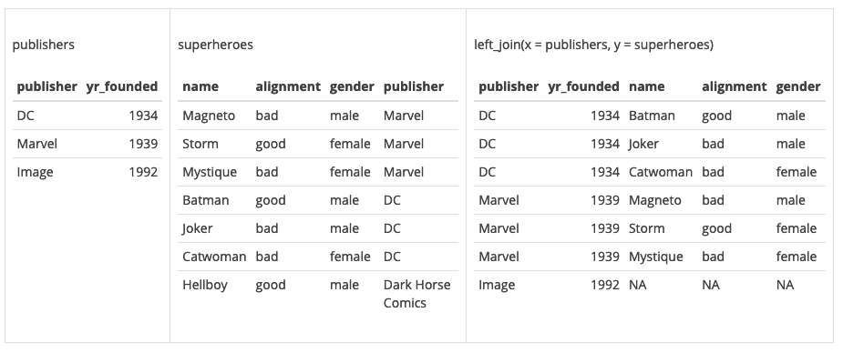

```{r setup, include=FALSE, message=FALSE}
# options(htmltools.dir.version = FALSE)
library(tidyverse)
# devtools::install_github('yihui/xaringan')
# full_join, inner_join, left_join, right_join, semi_join, anti_join
```

## Dados em múltiplas tabelas

* É comum que dados estejam guardados em múltiplas tabelas. Esse modelo de banco de dados é conhecido como *Modelo Relacional* (https://en.wikipedia.org/wiki/Relational_model), em que os dados são acessados através de um *nome de tabela*, uma *chave* (*key*) e uma *coluna* (*features*).

* Se espera que, em no mínimo uma tabela, a chave identifique unicamente cada observação.


* O material da aula é baseado no capítulo 13 do livro *R for Data Science* (Wickham & Grolemund, 2017). Leiam o capítulo para verem exemplos adicionais: http://r4ds.had.co.nz/relational-data.html

---

## Exemplo de Dados Relacionais

O pacote `nycflights13` contém 4 tabelas (`airports`, `planes`, `weather` e`airlines`) que são relacionadas com a tabela `flights`. 

As relações podem ser visualizadas no seguinte diagrama:


**Fonte:** [R for Data Science, Capítulo 13.](https://r4ds.had.co.nz/relational-data.html) Wickham & Grolemund, 2017. 

---
## Chaves (*Keys*)

As variáveis usadas para conectar cada par de tabelas são chamadas de **chaves**.

Chave: é uma variável (ou conjunto de variáveis) que identifica unicamente uma observação. 


Exemplo de base relacional: [Figura de Wikipedia - Relation Model](https://en.wikipedia.org/wiki/Relational_model)

---

## Exemplo: Super-heróis e Editoras

Qual é a chave que conecta as duas tabelas de dados: superheroes e publishers?


---

## Consultas

* Cada tabela, separadamente, funciona como os bancos de dados com que trabalhamos até agora.

* Uma coluna em comum entre as tabelas será usada como chave, ligando a informação de cada linha. Porém, não há garantias que o valor seja único, nem sempre qual coluna servirá de chave é óbvio. 

* Uma *consulta* (ou *query*) é um pedido do usuário ao *relational database management system* (RDBMS) que une informações de um grupo de indivíduos (baseados na chave) ao longo de várias tabelas.

* Nós vamos, primeiramente, examinar a operação *join*, do pacote `dplyr`, para realizar consultas em pares de tabelas.

---

## Exemplo


Professores e alunos da University of Washington, ciência da computação. 

Dados: https://relational.fit.cvut.cz/dataset/UW-CSE

Explicação: http://aiweb.cs.washington.edu/ai/mln/database.html

---

## Recuperando dados do MySQL server

Código apenas para a reprodução do exemplo. SQL será abordado só em aulas futuras.

<!-- # https://relational.fit.cvut.cz/dataset/UW-CSE 
# https://www.r-bloggers.com/accessing-mysql-through-r/ --> 

```{r eval=FALSE}
library(RMySQL)
mydb <- dbConnect(MySQL(), user='guest', password='relational', 
                 dbname='UW_std', port = 3306, 
                 host='relational.fit.cvut.cz')
rs <- dbSendQuery(mydb, "SELECT * FROM advisedBy")
advisedBy <- fetch(rs, n=-1)
rs <- dbSendQuery(mydb, "SELECT * FROM course")
course <- fetch(rs, n=-1)
rs <- dbSendQuery(mydb, "SELECT * FROM person")
person <- fetch(rs, n=-1)
rs <- dbSendQuery(mydb, "SELECT * FROM taughtBy")
taughtBy <- fetch(rs, n=-1)
dbDisconnect(mydb)
write.csv(advisedBy, "a03-advisedBy.csv", row.names = FALSE)
write.csv(course, "a03-course.csv", row.names = FALSE)
write.csv(person, "a03-person.csv", row.names = FALSE)
write.csv(taughtBy, "a03-taughtBy.csv", row.names = FALSE)
```


```{r echo=FALSE}
advisedBy <- read.csv("aula03/a04-advisedBy.csv", row.names = NULL)
course <- read.csv("aula03/a04-course.csv", row.names = NULL)
person <- read.csv("aula03/a04-person.csv", row.names = NULL)
taughtBy <- read.csv("aula03/a04-taughtBy.csv", row.names = NULL)
```

---

## advisedBy

```{r}
advisedBy %>% as_tibble
```

`p_id` orienta `p_id_dummy`.

---

## course

```{r}
course %>% as_tibble
```

`level_100` (introdução), `level_300` (graduação, segundo ano), `level_400` (graduação, avançado) e `level_500` (pós-graduação).

---

## taughtBy

```{r}
taughtBy %>% as_tibble
```

Qual curso em `course_id` e `p_id` de quem ensinou.

---

## person

```{r}
person %>% as_tibble
```

- `p_id` identifica indivíduos unicamente em `person`;

---

## Tabelas não são 1-1

```{r}
# Same course, different faculty
taughtBy %>% filter(course_id == 11)
# Same faculty, different course
taughtBy %>% filter(p_id == 40)
```

- `p_id` identifica indivíduos unicamente em `person`;
- `course_id` identifica cursos unicamente em `courses`.

---

## Objetivo da aula de hoje

* Como relacionar informação de diferentes tabelas?

* Por exemplo, é mais comum que professores adjuntos ensinem classes de pós-graduação?

* Nós sabemos trabalhar com tabelas isoladas. Para duas ou mais tabelas, consideraremos funções do tipo **JOIN**.


* Um *join* é uma maneira de conectar cada linha de uma tabela a nenhuma, uma ou várias linhas de outra.

* Examinaremos a operação *join* do pacote `dplyr`, para realizar consultas em pares de tabelas.

---

## Pacote `dplyr`

Para trabalhar com dados relacionais, você precisará conhecer verbos que lidem com pares de tabelas. 


No pacote `dplyr`, existem três famílias de verbos que são usados para esse fim:

* **Mutating Joins**: adicionam novas variáveis a uma tabela de dados a partir de observações correspondentes em outra tabela.

* **Filtering Joins**: filtram observações de uma tabela baseadas no fato de corresponderem ou não a uma observação em outra tabela.

* **Set Operations**: combinam as observações das tabelas como se fossem conjuntos de elementos.

Começaremos essa aula falando dos **Mutating Joins**.

---

## Tipos de JOIN: setup

Usando os diagramas de Wickham and Grolemund (2017), considere dados de duas tabelas:


<br />
A coluna colorida é a chave; `x` e `y` são colunas, tomando valores `x1`, `x2`, etc.

<br /><br /><br /><br />
Vamos criar essas tabelas de dados no R:   
```{r}
x <- data.frame(key = c(1,2,3), 
                val_x = c("x1","x2","x3"))

y <- data.frame(key = c(1,2,4), 
                val_y = c("y1","y2","y4"))
```

---

## INNER JOIN: inner_join

`inner_join(x,y)`: mantém somente as observações que estão em ambos `x` e `y`.


```{r}
x %>% inner_join(y, by = "key")
```


---
## Exemplo: Super-heróis e Editoras

```{r, echo=FALSE}
superheroes <- "
    name, alignment, gender,         publisher
 Magneto,       bad,   male,            Marvel
   Storm,      good, female,            Marvel
Mystique,       bad, female,            Marvel
  Batman,      good,   male,                DC
   Joker,       bad,   male,                DC
Catwoman,       bad, female,                DC
 Hellboy,      good,   male, Dark Horse Comics
"

superheroes = read_csv(superheroes, skip = 1)
```

```{r, echo=FALSE}
publishers <- "
  publisher, yr_founded
         DC,       1934
     Marvel,       1939
      Image,       1992
"

publishers = read_csv(publishers, skip = 1)
```

```{r, eval=FALSE}
publishers %>% inner_join(superheroes, by = "publisher")
```


---

## OUTER JOIN: left_join

`left_join(x, y)`: une as linhas correspondentes de `y` em `x`.


```{r}
x %>% left_join(y, by = "key")
```

---

## Exemplo: Super-heróis e Editoras

```{r, eval=FALSE}
publishers %>% left_join(superheroes, by = "publisher")
```



---

## OUTER JOIN: right_join

`right_join(x, y)`: une as linhas correspondentes de `x` em `y`.


```{r}
x %>% right_join(y, by = "key")
```

---

## Exemplo: Super-heróis e Editoras

```{r}
publishers %>% right_join(superheroes)
```

---

## OUTER JOIN: full_join

`full_join(x, y)`: mantém todas as observações e valores de `x` e `y`.


```{r}
x %>% full_join(y, by = "key")
```

---

## Exemplo: Super-heróis e Editoras

```{r, eval=FALSE}
superheroes %>% full_join(publishers, by = "publisher")
```


---

## Exemplo: que professores dão quais aulas?

Todos os professores de todos os cursos:

```{r}
person %>% 
  right_join(taughtBy, by = "p_id") %>% 
  as_tibble
```

---

## Exemplo: que professores dão quais aulas?

Vamos agora incluir o nível do curso.

```{r}
person %>%
  right_join(taughtBy, by='p_id') %>%
  left_join(course, by='course_id') %>%
  as_tibble() %>% 
  select(-professor, -student)
```


---

## Exemplo: que professores dão quais aulas?

Alguns estudantes ensinam classes avançadas.

```{r}
person %>% right_join(taughtBy, by='p_id') %>% 
  left_join(course, by='course_id') %>% 
  filter(student == 1) %>% 
  as_tibble() %>% select(-professor)
```

---

## Exemplo: que professores dão quais aulas?

```{r}
person %>% right_join(taughtBy, by='p_id') %>% 
  left_join(course, by='course_id') %>% 
  filter(student == 0) %>% group_by(hasPosition, courseLevel) %>% 
  tally()
```

---

## Chaves Duplicadas (*Duplicated keys*)

Como nós vimos no exemplo dos professores, chaves duplicadas em uma tabela não causam problema, desde que você escolha um join apropriado.


<br /><br /> 
Nesse exemplo, a coluna colorida é uma *primary key* em `y` e uma *foreign key* em `x`. 

<br /><br /><br /><br /><br />
Quando as chaves são únicas, elas são chamadas de **primary keys**; se há entradas repetidas, elas são chamadas de **foreign keys**. Os valores associados a primary keys são repetidos na tabela final.

---

## Chaves Duplicadas

Quando ambas as tabelas têm chaves duplicadas, ao fazer um join, será executado um produto cartesiano das entradas. 


Evite joins assim! Em tese, as bases relacionais devem ter pelo menos uma chave que unicamente determina as observações em cada tabela. 

---

## Sintaxe do argumento "by"

A ação padrão (*default*) das funções `*_join(x, y)` no `dplyr` é `by = NULL`, que realiza o join pela combinação de *todas* as colunas com nomes idênticos em x e y. Isso pode ser perigoso!

```{r}
x$newCol <- c(1, 1, 2)
y$newCol <- c(1, 2, 2)
full_join(x, y)
x$newCol <- NULL
y$newCol <- NULL
```

---

## Sintaxe do argumento "by"

Já `by = "colName"` une as observações pelo "colName" especificado.

```{r}
full_join(x, y, by = "key")
```

Caso você queira comparar diferentes colunas, a sintaxe é `by = c("colunaX" = "colunaY")`. Note que o `R` remove `key` de `y` sem avisar!

```{r}
x$newKey <- c(1,4,2)
full_join(x, y, by = c("newKey" = "key"))
x$newKey <- NULL
```

---

## Outras Implementações: `merge`

A função `merge()` da base do R pode executar todos os tipos de *mutating joins*:


---

## Outras Implementações: SQL

SQL serviu de inspiração para os verbos do `dplyr`:


---

## Filtering joins

Há dois importantes filtering joins:

* `semi_join(x, y)` mantém todas as observações em `x` que estão presentes em `y`.
* `anti_join(x, y)` remove todas as observações em `x` que estão presentes em `y`.

Esses `*_join` retornam tabelas `x` filtradas, e não unem `x` e `y`.

---

## semi_join

`semi_join(x,y)`: só retorna elementos de `x` que também estão em `y`.


Exemplo:

```{r}
all.equal(x %>% semi_join(y,  by = "key"),
          x %>% filter(key %in% y$key))
```

---

## Exemplo: Super-heróis e Editoras

```{r, eval=FALSE}
publishers %>% semi_join(superheroes, by = "publisher")
```


---

## semi_join: chaves duplicadas

Não há problema se as chaves forem duplicadas para o `semi_join`, isto é, o `semi_join` não duplica as linhas.


---

## anti_join

`anti_join(x,y)`: só retorna elementos de `x` que **não** estão em `y`. 


É útil para detectar se há chaves faltantes em uma tabela.

Exemplo:
```{r}
all.equal(x %>% anti_join(y,  by = "key"),
          x %>% filter(!(key %in% y$key)))
```

---

## Exemplo: Super-heróis e Editoras

```{r, eval=FALSE}
publishers %>% anti_join(superheroes, by = "publisher")
```


---

## Set Operations

Esses verbos são usados com menor frequência, mas ocasionalmente podem ser úteis.

Aqui, espera-se que as tabelas `x` e `y` tenham as mesmas variáveis e as observações são tratados como conjuntos de elementos.

Todas essas operações usam a linha completa, comparando os valores de todas as variáveis.

Vamos usar essas duas tabelas como exemplo:

```{r, echo=FALSE, eval=FALSE}
x <- data.frame(key = c(1, 1, 2), 
                value = c("a", "b", "a"))
y <- data.frame(key = 1:2, 
                value = c("a", "b"))
```


---

## Interseção

`intersect(x, y)`: retorna apenas as observações que estão em ambos `x` e `y`. 


---

## União

`union(x, y)`: returna observações que estão em `x` ou `y`. 


---

## Diferença

`setdiff(x, y)`: retorna observações que estão em `x`, mas não em `y`. 


---

# Referência

* [R for Data Science - https://r4ds.had.co.nz/](https://r4ds.had.co.nz/)


