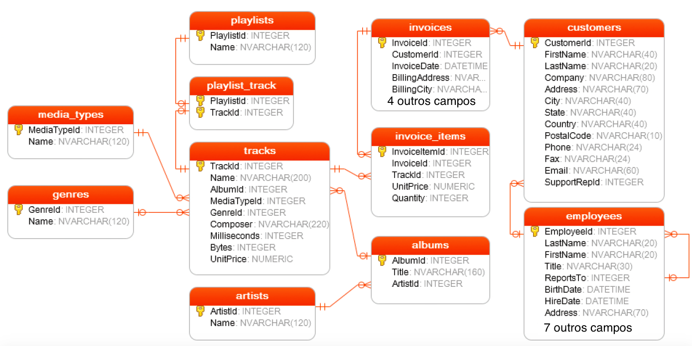

```{r setup, include=FALSE}
options(htmltools.dir.version = FALSE)
```

## O que é SQLite?

- Biblioteca embutida em um processo que implementa um mecanismo de banco de dados SQL:
    - autônomo;
    - sem servidor;
    - com zero de configuração;
- Código de domínio-público com uso gratuito para qualquer uso:
    - comercial;
    - privado;
- Lê e escreve diretamente de/para arquivos comuns em disco;
- Sistema SQL completo com múltiplas tabelas, índices, gatilhos e visões em um único arquivo em disco;
- O arquivo produzido pelo SQLite funciona em qualquer plataforma;
- Aproximadamente 600KB;
- LTS.
---

## SQLite é o banco de dados mais implantado no mundo

- Photoshop Lightroom;
- Software de vôo para a família Airbus A350 XWB;
- Apple iTunes;
- Sistemas multimídias da GM, Nissan e Suzuki geridos pela Bosch;
- Dropbox;
- Android;
- Preferível pela Biblioteca do Congresso;
- Sistema de armazenamento:
    - Windows 10;
    - Firefox e Thunderbird;
    - Skype;
- Sistema de rastreamento de versões do RPM/RedHat;

---

## Banco de Dados de Exemplo: `disco.db`



---

## Instalando SQLite

- O banco de dados apresentado pode ser acessado diretamente via SQLite;
- Visite o site [www.sqlite.org](www.sqlite.org);
- Existem múltiplas versões para download:
    - Código-fonte;
    - Linux;
    - Mac OS X;
    - Windows (32/64 bits);
    - Windows Phone;
    - Android;
- Essencialmente, linha de comando (meu predileto...);
- Existem interfaces gráficas para "facilitar"...

---

## Usando o R como Interface para SQLite

- O R possui um pacote chamado `RSQLite`;
- O `RSQLite` oferece *todos* os recursos do `SQLite` diretamente dentro do R;
- Apesar de, neste caso, estarmos dentro do R, os comandos são passados diretamente para o motor do SQLite, que é instalado automagicamente no momento da instalação do pacote.

```{r install_rsqlite, eval=FALSE}
install.packages("RSQLite")
```

```{r load_pkg}
library(RSQLite)
db = dbConnect(SQLite(), '../dados/disco.db')
db
```

---

## Manipulação Básica

- Quais são as tabelas existentes no banco de dados?
- Quais são as colunas na tabela `albums`?

```{r basics1}
dbListTables(db)
dbListFields(db, 'albums')
```

---

## Manipulação Básica: Selecionando registros

- O comando `dbGetQuery` consulta o banco de dados, extrai os resultados solicitado e **os retorna** ao R;
- A sintaxe é `dbGetQuery(<conexao>, <chamada SQL>)`;
- Extraia da tabela `albums` todas as colunas e todas as linhas e armazene-os em um objeto chamado `album_db`:

```{r select1}
album_db = dbGetQuery(db, 'SELECT * FROM albums')
head(album_db)
dim(album_db)
```

---

## O Comando `SELECT`

- O comando `SELECT` é o comando mais utilizado em SQL;
- É, também, um dos comandos mais complexos;
- Pode ser combinado com uma série de argumentos:
    - `ORDER BY`: ordernar o resultado;
    - `DISTINCT`: pesquisar por linhas únicas;
    - `WHERE`: filtrar linhas;
    - `LIMIT`: restringir o número de linhas do resultado;
    - `INNER JOIN`/`LEFT JOIN`: consultar múltiplas tabelas;
    - `GROUP BY`: agrupar e aplicar funções para agregação nos grupos;
    - `HAVING`: filtrar em grupos;

---

## Seleção de colunas específicas e ordenação de resultados

Selecione as colunas `trackid`, `name`, `composer` e `unitprice`. Ordene o objeto resultante por `unitprice`.

```{r select2}
sql = paste('SELECT trackid, name',
            'FROM tracks ORDER BY name')
res = dbGetQuery(db, sql)
head(res)
```

---

## Seleção de Registros Diferentes

Quais são as cidades de todos os clientes, ordenadas por nome de cidade?

```{r ex3a}
sql = 'SELECT city FROM customers ORDER BY city'
ex3a = dbGetQuery(db, sql)
head(ex3a)
dim(ex3a)
```

---

## Seleção de Registros Diferentes

Quais são as cidades de todos os clientes, ordenadas por nome de cidade?

```{r ex3b}
sql = 'SELECT DISTINCT city FROM customers ORDER BY city'
ex3b = dbGetQuery(db, sql)
head(ex3b)
dim(ex3b)
```

---

## Seleção com Condições

Quais são todas as músicas do álbum 1?

```{r ex4}
dbGetQuery(db, 'SELECT name, albumid FROM tracks WHERE albumid=1')
```

---

## Seleção com Condições Complexas

Limitando-se a 5 registros, após ordenação por nome, quais são os nomes, ID de álbum e ID de mídia de músicas com mídias de tipo 1 ou 2?

```{r ex6}
sql = paste('SELECT name, albumid, mediatypeid FROM tracks',
            'WHERE mediatypeid IN (1, 2)',
            'ORDER BY name LIMIT 5')
dbGetQuery(db, sql)
```

---

## Seleção de Seleção

Quais são as músicas e identificadores de faixa e álbum produzidas pelo artista que identificador 12?

```{r}
sql = paste('SELECT trackid, name, albumid FROM tracks',
            'WHERE albumid IN',
            '(SELECT albumid FROM albums WHERE artistid==12)',
            'LIMIT 5')
dbGetQuery(db, sql)
```

---

## Seleções Complexas

Quais são as faixas cujos nomes começam com qualquer caracter seguido de 'ere' e terminam com qualquer expressão?

```{r}
sql = "SELECT trackid, name FROM tracks WHERE name GLOB '?ere*'"
dbGetQuery(db, sql)[1:5,]
```

---

## Seleções Complexas

Quais são as faixas cujos nomes possuem algum dígito?

```{r}
sql = "SELECT trackid, name FROM tracks WHERE name GLOB '*[0-9]*'"
dbGetQuery(db, sql)[1:5,]
```

---

## Agregação por Grupos de Variáveis

Quantas faixas por disco?

```{r}
sql = 'SELECT albumid, COUNT(trackid) FROM tracks GROUP BY albumid'
dbGetQuery(db, sql)[1:5,]
```

---

## Agregação por Grupos de Variáveis com Filtro

Quantas faixas por disco para o album 1?

```{r}
sql = paste('SELECT albumid, COUNT(trackid)',
            'FROM tracks GROUP BY albumid',
            'HAVING albumid=1')
dbGetQuery(db, sql)
```

---

## Banco de Dados de Exemplo: `disco.db`


---

## `INNER JOIN`

Quais são os nomes de cada faixa com os respectivos títulos dos álbums?

```{r}
sql = paste('SELECT trackid, name, title FROM tracks',
            'INNER JOIN albums ON albums.albumid=tracks.albumid')
dbGetQuery(db, sql)[1:5,]
```

A sintaxe é análoga para `LEFT JOIN`

---

## Funções de Agregação

- `AVG`: `AVG([ALL | DISTINCT] expressao)` calcula a média de todos os valores não-nulos ou dos valores distintos;
- `COUNT`: `COUNT([ALL | DISTINCT] expressao)` realiza a contagem de todos registros;
- `MAX`, `MIN`, `SUM` funcionam de maneira análoga às funções anteriores;

```{r bye, echo=FALSE, include=FALSE}
dbDisconnect(db)
```
