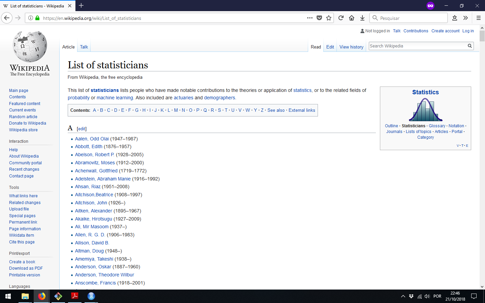
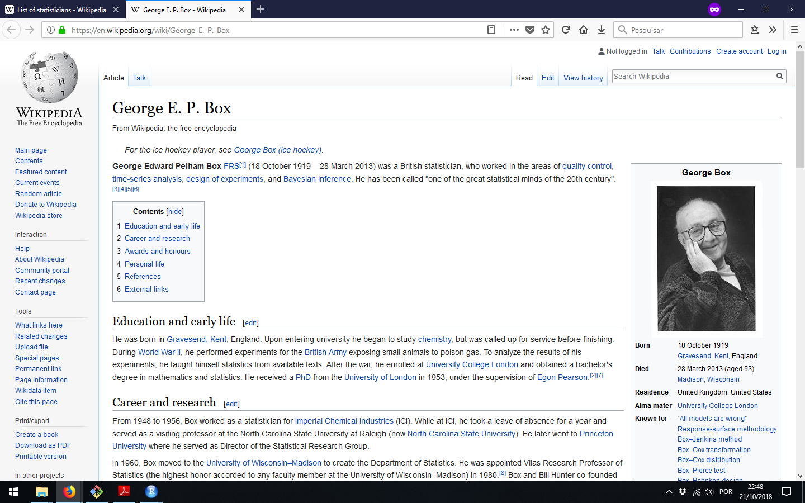
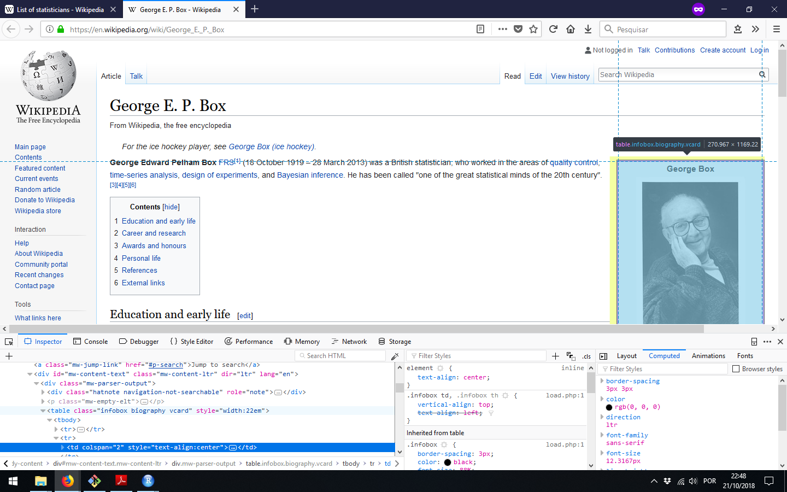
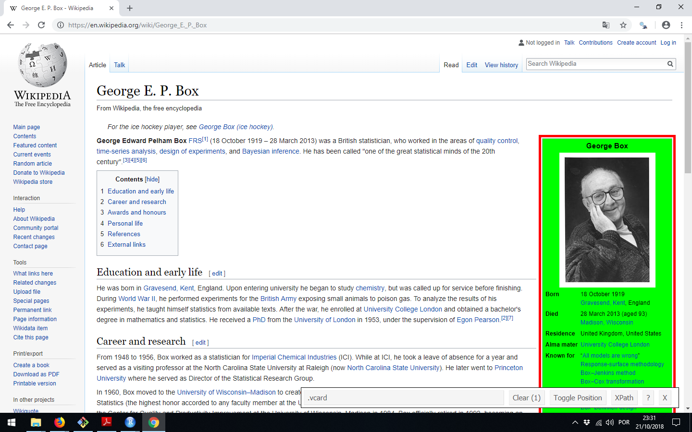

```{r setup, include=FALSE}
# Export to PDF with 
# library(webshot) # install_phantomjs() 
# webshot("aula13.html", "aula13.pdf")
# http://material.curso-r.com/scrape/
options(htmltools.dir.version = FALSE, warning = FALSE)
```

## Webscraping

- É possível "raspar" (*scrape*) informações de páginas da internet, e guardá-las em um banco de dados. A prática é chamada de *webscraping*.
- Nós iremos usar o pacote `rvest`, que simplifica algumas operações dos pacotes `xml2` e `httr`.

```{r load_pkg, message = FALSE, warning = FALSE}
library(tidyverse)
library(RSQLite)
library(httr)
library(rvest)
```

---

## Idéias

Uma página da web é um documento que pode ser exibido por um navegador. Estes documentos normalmente exibem resultados de consultas à bancos de dados, que são nosso principal interesse nesta disciplina. Em geral:

- Páginas simples podem ser acessadas através do R com o pacote `rvest`.
- Páginas dinâmicas podem exigir alguma autenticação do usuário, na forma de *cookies*. Para acessar essas páginas, podemos precisar do pacote `httr`.
- Nosso objetivo é coletar dados com o `rvest` (e talvez `httr`) e armazená-los em um banco de dados.

Alguns recursos:
- http://material.curso-r.com/scrape/: Material organizado pelo pessoal do Curso-R sobre webscraping (com mais exemplos).
- https://blog.rstudio.com/2014/11/24/rvest-easy-web-scraping-with-r/: Tutorial do Rvest (pode estar  desatualizado).

---

## HTML

Inevitavelmente, vocês deverão ter alguma idéia de HTML (pelo menos como funciona). Em geral, páginas html são texto estruturado, interpretado pelo navegador. Veja exemplos em: https://www.w3schools.com/html/html_basic.asp

```
<!DOCTYPE html>
<html>
<body>

<h1>My First Heading</h1>
<p>My first paragraph.</p>

</body>
</html>
```

Note: "body" na linguagem do `rvest` é um `node`. Dentro desse node, há um node tipo `h1` (cabeçalho) e outro tipo `p` (parágrafo). Nodes interessantes incluem `table`, `a` (links) e `img`.

---

## Exemplo: wikipedia

A *wikipedia* é particularmente interessante para scraping, pois ela possui muitas páginas com listas, de onde podemos começar nossas buscas. Por exemplo,

https://en.wikipedia.org/wiki/List_of_statisticians

Podemos estar interessados em compilar uma lista com nome, *alma mater*, data de nascimento (e local), e data de falecimento (caso já tenha falecido) de estatísticos famosos.

---

## Lista de Estatísticos



---

## Página: George Box



---

## Tabela de Interesse



---

## SelectorGadget

Uma ferramenta recomendada pelo `rvest` é o chamado `SelectorGadget` (https://selectorgadget.com/), que mostra o nome de um "selector" em CSS. Há uma extensão para o navegador Chrome que permite que você use o SelectorGadget em qualquer página.

Com o selector correto, você pode acessá-lo usando `html_nodes()`. Selectors interessantes incluem `"tables.<nome>"` e `"li"`. É preciso inspecionar as páginas de interesse caso a caso.

---

## Usando SelectorGadget (Chrome)



---

## Tabela de interesse

```{r}
url = "https://en.wikipedia.org/wiki/George_E._P._Box"
webpage <- read_html(url)

table <- webpage %>%
html_nodes("table.vcard") %>% # SG
html_table(header = FALSE)

# Retorna uma lista de tabelas... eu só quero a primeira
table <- table[[1]]
```

---

## Conteúdo

```{r}
table %>% as.tibble
```

---

## Conteúdo (limpeza com regex)

```{r echo = FALSE}
table %>% 
  mutate(X2 = gsub("\\n"," ", X2)) %>% 
  mutate(X2 = gsub("\\s"," ", X2)) %>% 
  mutate(X1 = gsub("\\s"," ", X1)) %>% 
  mutate(X2 = gsub("\\[[[:digit:]]\\]"," ", X2)) %>% 
  as.tibble
```

---

## Procurando Links

Inspecionando a página no navegador, eu descobri que dentro de `body #content` (o conteúdo da página) os links estão guardados no node `"li"`.

```{r}
url = "https://en.wikipedia.org/wiki/List_of_statisticians"
listPages <- read_html(url)
links <- listPages %>%
  html_nodes("body #content") %>% # Inspect Object...
  html_nodes("li") # All links
```

---

## Procurando Links

```{r}
links
```

---

## "Sajid Ali Khan, Rawalakot" até "Zipf, George Kingsley"

```{r}
estat1 = links %>%
  as.character %>%
  grep("Sajid Ali Khan, Rawalakot", .)
estatN = links %>%
  as.character %>%
  grep("Zipf, George Kingsley", .)
estat1
estatN
links <- links[estat1:estatN]
```

---

## Páginas individuais

```{r}
links
```

---

## Páginas individuais

```{r}
links %>%
  html_nodes("a")
```

---

## Páginas Individuais

```{r}
links %>%
  html_nodes("a") %>%
  html_attr("href") # Salvar title também!
```

---

## DB

A melhor maneira de armazenar o conteúdo das páginas é através de um banco de dados.

```{r eval=TRUE}
li <- links %>% html_nodes("a") %>% html_attr("href") 
li <- paste0("https://en.wikipedia.org", li)
names <- links %>% html_nodes("a") %>%  html_attr("title")
db = dbConnect(SQLite(), "estatisticos.db")
bad = c("page does not exist", "Florence Nightingale", "Harold Wilson")
bad1 = unlist(sapply(bad, grep, names))
bad2 = unlist(sapply(c("mshkhan", "redlink", "orghttp"), grep, li))
names = names[-c(bad1, bad2)]
li = li[-c(bad1, bad2)]
dbWriteTable(db, "person", data.frame(id = seq_along(names),
                                      names = names, 
                                      links = li))
dbExecute(db, "CREATE TABLE info
               (id INTEGER, Born TEXT, Died TEXT,
                AlmaMater TEXT)")
```

---

## Conferindo...

```{r echo = FALSE, message = FALSE, warning = FALSE}
db = dbConnect(SQLite(), "estatisticos.db")
```

```{r}
dbGetQuery(db, "SELECT * FROM person LIMIT 4")
```

---

## Extraindo tabelas (demora alguns minutos...)

```{r, message=FALSE, warning=FALSE}
library(doMC) ## se windows library(doParallel)
registerDoMC(4) ## se windows registerDoParallel(nproc)
f <- function(x){
  if(length(x) == 0){
    return(NA_character_) 
  } else {
    return(x)
  }
}
out = foreach(i=seq_along(li), .combine=rbind) %dopar% {
  webpage <- read_html(li[i])
  table <- webpage %>%  html_nodes("table.vcard") %>%
    html_table(header = FALSE)
  if(length(table) == 0) return(NULL)
  table <- table[[1]]
  data.frame(id = i, 
             Born = f(table[grep("Born", table$X1), 2]),
             Died = f(table[grep("Died", table$X1), 2]),
             AlmaMater = f(table[grep("Alma", table$X1), 2]))
}
dbWriteTable(db, "info", out, overwrite=TRUE)
```

---

## Consultando nossa tabela

O código quebrou com *Florence Nightingale* e *Harold Wilson*, porque tinham muitos campos diferentes do esperado, ficando inconsistente com as tabelas anteriores. Estes podem ser trabalhados manualmente. Fora isso, o código de scraping funciona bem:

```{r}
dbGetQuery(db, "SELECT names, Born, Died, AlmaMater FROM info
                INNER JOIN person ON info.id = person.id
                LIMIT 8") %>% as.tibble
```

---

## Crawlers + Cron

- *Crawlers* são programas de scraping que interpretam conexões nas páginas e continuam buscando novas páginas. Estão bem além do escopo do nosso curso.
- `cron` é um programa de Linux que permite executar outros programas em intervalos fixos de tempo. Existe um pacote, `cronR` (https://cran.r-project.org/web/packages/cronR/README.html), que permite executar scripts de R em períodos fixos de tempo. Em conjunto com uma base de dados, é possível coletar dados periodicamente (por exemplo, com o `tweetR` ou em páginas de notícias).

Fechando base de dados...

```{r}
dbDisconnect(db)
```