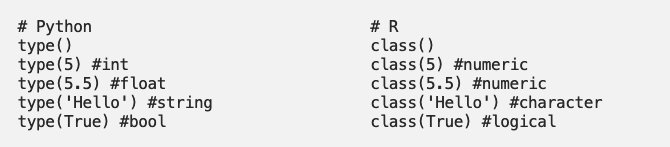
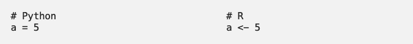
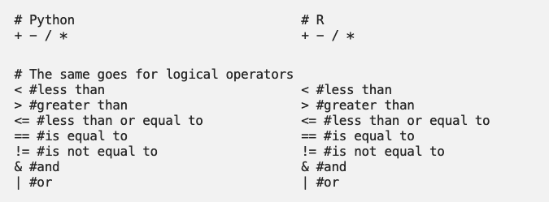
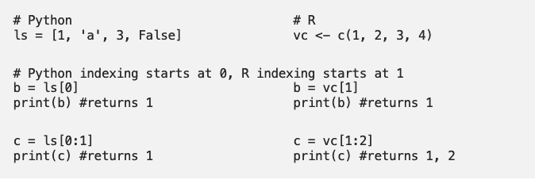
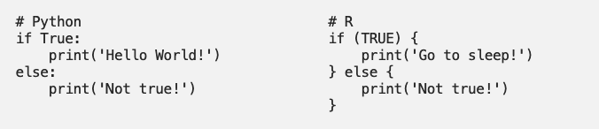
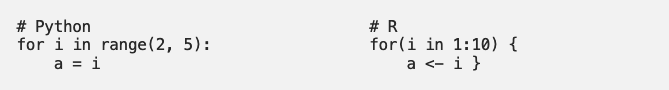
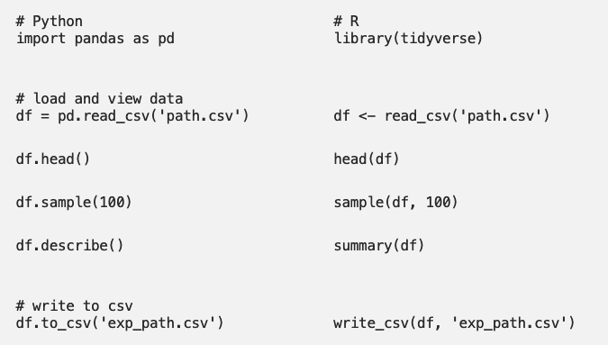

```{r setup, include=FALSE}
options(htmltools.dir.version = FALSE)
```

# Fatos sobre Python


- Linguagem interpretada, orientada a objeto;
- Possui estruturas de dados de alto nível;
- Usado para scripts ou, apenas, como conector entre diferentes ferramentas;
- Enfatiza a habilidade de leitura do código;
- Utiliza "pacotes", estimulando a modularidade de código;
- Ao contrário do R, não existe um foco (central da linguagem) na análise de dados;
- Gratuito e disponível na maior parte das plataformas.

---

# Pandas


- Biblioteca do Python voltada para a estruturação de dados;
- Permite a leitura e escrita de dados em vários formatos: CSVs, Excel, SQL, entre outros;
- Alta performance, código aberto;
- Permite a realização de análise de dados e modelagem (torna possível a análise sem precisar mudar para R);
- Pandas não implementa estratégias avançadas de análise de dados;
- Estratégias mais elaboradas de análise de dados estão disponíveis em:
  * Statsmodels: http://www.statsmodels.org
  * Scikit-Learn: https://scikit-learn.org
  * TensorFlow: https://www.tensorflow.org/

Mais informações: https://pandas.pydata.org/

Pandas Cheat Sheet: https://pandas.pydata.org/Pandas_Cheat_Sheet.pdf

---

# Pandas


**Pontos Positivos**
- Extremamente fácil de usar, exigindo uma pequena curva de aprendizagem para lidar com dados tabulares;
- Conjunto grande de ferramentas para carregar, transformar e escrever dados em vários formatos;
- Principal escolha para a maioria das bibliotecas usadas em Machine Learning;
- Capacidade para gráficos e visualizações de dados (usando matplotlib);

**Ponto Negativo**
- Grande ocupação da memória, pois cria muitos objetos adicionais para rápido acesso e facilidade de manipulação;


---

# Instalação do Python e Pandas

**No Linux**,

```
sudo apt-get install python3 python3-pip
sudo pip3 install pandas
```

**No MacOS**,

```
brew install python3 python3-pip
pip3 install pandas
```

**No Windows**,

- Baixar o instalar em https://www.python.org/downloads/windows/
- Marcar a opção `add to PATH` no começo do processo
- `python` e `pip` ficarão disponíveis no Windows PowerShell.
- Executar:
```
pip install pandas
```

---

## Chamando o Python a partir do R

- Você pode, também, usar o Python a partir do R;
- Cenários assim são comuns quando você precisa conectar ferramentas disponíveis em cada uma das linguagens;
- Por exemplo, para criar as notas de aula em `RMarkdown`;


- Para acessar o Python, você deve utilizar o pacote `reticulate`. Para instalar o pacote:
    ```{r, eval=FALSE}
    install.packages("reticulate")
    ```


- O código a ser executado em Python deve estar contido num `chunk` específico para `python`;

---

# Chamando o Python a partir do R

```{r}
library(reticulate)
py_discover_config() # Qual versão do Python está instalada?
```

Você pode especificar a versão a ser usada:
```{r}
use_python("/usr/local/bin/python3")
```

**Referência:** McKinney (2013) *Python for data analysis*, O'Reilly. O livro é do criador do pacote `pandas`, Wes McKinney.

---

# Python como uma calculadora

**Tutorial:** https://docs.python.org/3/tutorial/

```{python}
# Comentários são precedidos por #
dir() # Lista variáveis no workspace
a = 5 # int
print(a) # Desnecessário em modo interativo
a + 2
a / 2
```

---

# Python vs R


Se olharmos lado a lado, ambos funcionam de maneira similar e são bem parecidos, apenas com algumas pequenas diferenças em suas sintaxes.

**Tipos de Dados:**




**Assinalando variáveis:**



```{python, echo=FALSE}
a = 5
```


---

# Python vs R

Operadores algébricos e lógicos são iguais!



```{python}
a == 5
a < 3
```

---


## Listas e Vetores


Em `Python`, uma **lista** é uma coleção mutável de elementos de qualquer tipo. O índice de uma lista em Python começa em 0 e é não inclusivo.

Em `R`, um **vetor** é uma coleção mutável de elementos do mesmo tipo. O índice de um vetor em  `R` começa em 1 e é inclusivo.



---

# Os objetos carregam seus próprios métodos

```{python}
b = "ME315" # str
print(b)
# help(b)  ## ajuda: mas nao dentro do RStudio
# help(matplotlib) ## ajuda: tambem para pacotes
print(b.endswith("A"))
print(b.endswith("5"))
```

---

## Indexando Vetores

Índices de vetores no Python começam no 0. Strings são vetores de caracteres.

```{python}
print(b)
print(b[0]) # First letter
print(b[1]) # Second letter
print(b[-1]) # Last letter
```

---

## Indexando Vetores

Referência parcial a objetos e concatenação.

```{python}
print(b[:2])
print(b[2:])
print(b[:2] + b[2:])
```

---

## Vetores numéricos

Vetores em Python são guardados em listas.

```{python}
x = [1, 2, 4, 8, 16]
print(x)
print(x[-2:]) # Últimos 2 elementos
x2 = x + [32, 64, 128] # Concatenação
print(x2)
```

---

## Mais sobre listas

```{python}
print(x2)
x2[0] = 3 # Modificar valores
print(x2)
del x2[0] # Remover valores
print(x2)
```

---

## Listas de listas

```{python}
a = ["a","b","c"]
n = [12, 15, 7]
x = [a,n] # Listas de listas
print(x)
```

**Note:** no R, `data.frames` são listas de listas; é errado, do ponto de vista de programação, pensar em `data.frames` como planilhas (i.e. acessar linhas é *lento*, acessar colunas é relativamente rápido).

```{python}
print(x[1]) # Acesso à segunda lista
print(x[1][0])
```

---

## Controle de Fluxo

O python naturalmente possui as ferramentas usuais de controle de fluxo, tais como: **if, for, while**
 
**If/Else**



**For loops**


    
Estrutura de programação é um tópico complexo. Iremos apenas ilustrar o uso das ferramentas com alguns exemplos. 

---

## IF

**Importante:** Identação é feita com tabulações (`\t`) ou dois espaços, e é parte da sintaxe!

```{python}
x = 2
if x < 0:
  x = 0
  print('Negative changed to zero')
elif x == 0:
  print('Zero')
elif x == 1:
  print('Single')
else:
  print('More')
```

---

## FOR

**Importante:** Identação é feita com tabulações (`\t`) ou dois espaços, e é parte da sintaxe!

```{python}
words = ['Matemática', 'Estatística', 'Ciência de Dados']
for w in words:
  print(w, len(w))
```

---

# Ainda sobre FOR

```{python}
words = ['Matemática', 'Estatística', 'Ciência de Dados', 'IMECC']
for w in words:
  if len(w) >= 6:
    print(w[:3] + '...')
  else:
    print(w)
```

---

## DEF

A função `def` permite definir funções. Note o escopo!

```{python}
def wins(arr, howMany): # Média Winsorized
  """Linha com documentacao"""
  if len(arr) < 2*howMany:
    return NaN # error
  else:
    arr.sort()
    for i in range(0, howMany, 1):
      arr[i] = arr[howMany]
      arr[-(i+1)] = arr[-(howMany+1)]
    result = sum(arr)/len(arr)
    return result

a = [4, 7, 3, 4, 5, 2, 1, 6, 999] 
print(wins(a, 2))
a = [4, 7, 3, 4, 5, 2, 1, 6, 999] # Escopo!!
print(sum(a)/len(a))
```

---

# Manipulação de Dados

- Em R, o `tidyverse` é a biblioteca que vocês utilizaram para carregar e manipular bancos de dados usando o objeto `data.frame`.

- Em python, `pandas` é a biblioteca equivalente ao `tidyverse`, mais comumente usada para carregar e manipular data frames usando o objeto `DataFrame`. 

    