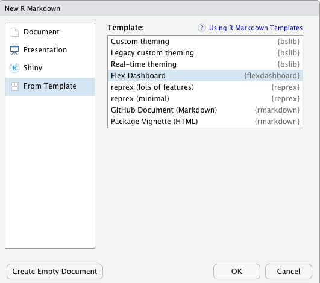
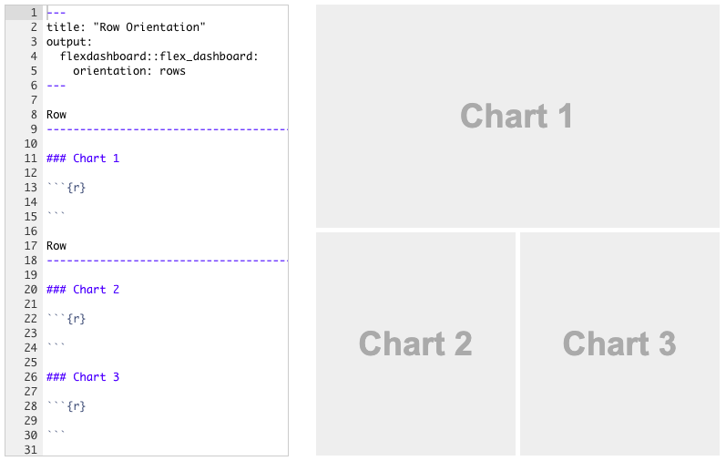

## O pacote `flexdashboard`

```{r, echo=FALSE, out.width="25%", fig.align='center'}
knitr::include_graphics("logo_flexdashboard.png")
```


Permite:

* o uso de RMarkdown para a criação de visualizações do tipo dashboards;
* o emprego de componentes diversas como htmlwidgets, dados tabulares, anotações, medidores;
* a utilização de diferentes formatos de apresentação.

---

## Criando um dashboard

* Instale o pacote `flexdashboard`;
* Utilizando os menus do RStudio:
    * File
    * New File
    * RMarkdown
    * From Template
    * Flexdashboard

```{r, echo=FALSE, out.width="50%", fig.align='center'}

```

---

# Dashboard de Coluna Única

* Dashboards são divididos em linhas e colunas;
* Componentes de saída são marcados usando cabeçalhos markdown de nível 3 (`###`);
* Por padrão, dashboards são criados com uma única coluna;
    - gráficos empilhados verticalmente em uma coluna;
    - coluna com tamanho para preencher verticalmente a janela do browser.

```{r, echo=FALSE, fig.align='center', out.width='70%'}

```

---

# Dashboard com Coluna Única e Rolamento

* Algumas vezes, pode ser interessante ter a possibilidade de rolar a tela;
* Isto permite que componentes tenham alturas naturais (que não se encaixariam no formato anterior);
* Observe a mudança para `vertical_layout: scroll`.

```{r, echo=FALSE, fig.align='center', out.width='70%'}

```

---

# Dashboard com Múltiplas Colunas

* Para utilizar várias colunas, você necessita de cabeçalhos markdown nível 2 (`-----------`) para cada coluna;
* Cada coluna pode ter tamanhos diferentes.

```{r, echo=FALSE, fig.align='center', out.width='70%'}

```

---

# Dashboard com Orientação de Linhas

* Ao invés de múltiplas colunas, você pode escolher que seu dashboard tenha múltiplas linhas;
* Para isso, utilize a opção `orientation: rows`;

```{r, echo=FALSE, fig.align='center', out.width='70%'}

```

---

# Componentes HTML Widgets

Você pode utilizar ferramentas de visualização dinâmica:

* Leaflet: mapas dinâmicos
* dygraphs: visualização de séries temporais
* Plotly: gráficos interativos (inc. ggplot2)
* rbokeh: gráficos interativos para web
* Highcharter: gráficos interativos para web
* visNetwork: visualização de redes

---

# Componentes Gráficas e Tabulares

* Gráficos:
    * Podem ser utilizados sem maiores configurações;
    * Basta adicionar o código para o gráfico de interesse em um chunk;
    * Assim como em documentos RMarkdown, você pode configurar dimensões usando `fig.height` e `fig.width`;
* Tabelas
    * Podem ser adicionadas via `knitr::kable` ou `DT::datatable`;
    * `knitr::kable`: tabelas estáticas
    * `DT::datatable`: tabelas dinâmicas
    
---

# Caixas de Valores

* Componentes gráficas
* Permitem adição de texto e valores
* Título é adicionado com `###`
* Sintaxe: `valueBox(valor, icon = icone, color = cor)`
* Valor: valor numérico
* Icon: ícone de versões gratuitas da "Font Awesome" ("fa-<icone>"), "Ionicons" ("ion-<icone>") ou "Bootstrap Glyphicons" ("glyphicon-<icone>")
* Color: "primary", "success", "warning" ou "danger" (também vale qualquer cor CSS válida)

```{r, echo=FALSE, fig.align='center', out.width='100%'}

```

---

# Medidores

* Componente Gráfica
* Apresenta medidor (imagine um velocímetro analógico)
* Título é adicionado com `###`
* Sintaxe: `gauge(valor, min = , max = , symbol = , gaugeSectors(
  success = <fx>, warning = <fx>, danger = <fx>))`


```{r, echo=FALSE, fig.align='center', out.width='100%'}

```

---

# Outras Possibilidades

* Ao necessitar de interações em seu webapp, busque entradas/saídas via Shiny (procure o site com exemplos)
* Funções de interesse  podem ser:
    - `sliderInput`
    - `checkboxInput`
    - `selectInput`
* Acima: acessíveis via `input$<objeto>`
* Procure, também, as funções do tipo `render*` (eg.: `renderPlot()`)

---

# Referências

- [https://pkgs.rstudio.com/flexdashboard/](https://pkgs.rstudio.com/flexdashboard/)