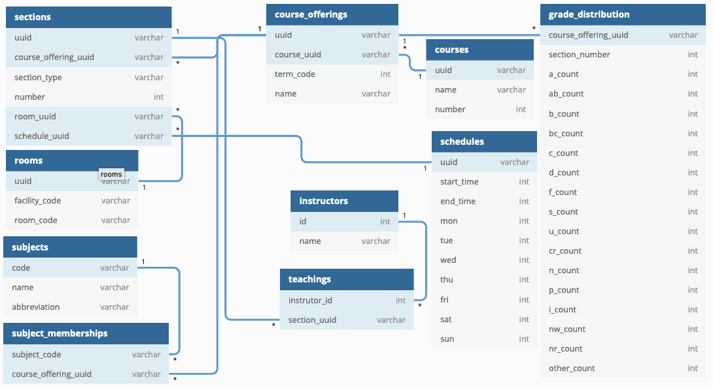

```{r setup, include=FALSE}
knitr::opts_chunk$set(echo = FALSE, eval=FALSE)
```

## SQLite

O **SQLite** é uma biblioteca embutida em um processo único que é autônomo, não necessita de servidor e exige zero de configuração. O código é de domínio público e seu uso é gratuito em qualquer tipo de utilização. Trata-se de um sistema SQL completo, capaz de utilizar múltiplas tabelas, índices, gatilhos e visões. Ele funciona, virtualmente, em qualquer plataforme (incluindo móveis) e pesa cerca de 600KB.

## Objetivos

Ao fim deste laboratório, você deverá ser capaz de:

  - Conectar-se a um banco de dados do tipo SQLite utilizando o R como interface;
  - Explorar quais são as tabelas disponíveis no referido banco de dados;
  - Identificar quais são as colunas de uma dada tabela existente no banco de dados;
  - Realizar pesquisas simples;
  - Extrair registros do banco de dados e armazená-las em objetos do R;
  - Realizar algumas pesquisas complexas, utilizando `WHERE`, `INNER JOIN`.
  - Criar novas tabelas no banco de dados.

## Fonte do problema:

Estes dados são de uma iniciativa de publicidade de desempenho de alunos e professores nas Universidades Americanas. A UW-Madison disponibilizou os seus dados online (no Office of the Registrar: https://registrar.wisc.edu/), e alguém trouxe os dados para uma competição no Kaggle (https://www.kaggle.com/Madgrades/uw-madison-courses). Nesta atividades, examinaremos disciplinas oferecidas no assunto de Estatística pela referida Universidade. O esquema do banco de dados é apresentado na figura abaixo.



## Observações

- Esta tarefa não deve ser realizada no site jupyter.ime.unicamp.br ;
- Você deve realizar o download dos dados para o computador que estiver utilizando e, então, iniciar a atividade;
- Recomenda-se a utilização dos seguintes pacotes:
    * `RSQLite`
- Toda a atividade deve ser realizada utilizando-se apenas de SQLite (i.e., não utilize `dbplyr`);

## Atividade

1. Baixe o arquivo `uwmadison.sqlite3`. Conecte-se a ele usando o pacote `RSQLite`, armazenando a conexão em uma variável `conn`.

```{r q2}
library(RSQLite)
conn = dbConnect(SQLite(), '../dados/uwmadison.sqlite3')
```

2. Quem são e quantos são os professores que lecionaram disciplinas cujo tópico era estatística (`subjects.abbreviation='STAT'`);

```{r}
dbExecute(conn,
           "CREATE VIEW courses_stat AS
           SELECT DISTINCT(course_offering_uuid) FROM subject_memberships
           INNER JOIN subjects
           ON subject_memberships.subject_code=subjects.code
           WHERE subjects.abbreviation='STAT' ")
dbGetQuery(conn,
           "SELECT instructors.name FROM sections
           INNER JOIN courses_stat, teachings, instructors
           ON courses_stat.course_offering_uuid=sections.course_offering_uuid AND
           teachings.section_uuid=sections.uuid AND
           instructors.id=teachings.instructor_id")
```


3. O GPA americano é definido numa escala de 0 a 4, em que A = 4, AB = 3.5, B = 3, BC =  2.5, C = 2, D = 1 e F = 0. Determinando a nota média de cada oferecimento pela ponderação da quantidade de alunos em cada extrato com os valores numéricos de cada conceito, indique (no que se referente a disciplinas no assunto de estatística):

  - Quem é o professor mais difícil?
  - Quem é o professor mais fácil?
  - Qual é a disciplina mais difícil?
  - Qual é a disciplina mais fácil?

4. Desconecte do banco de dados.
